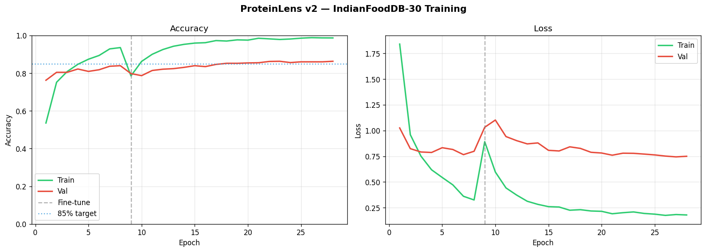
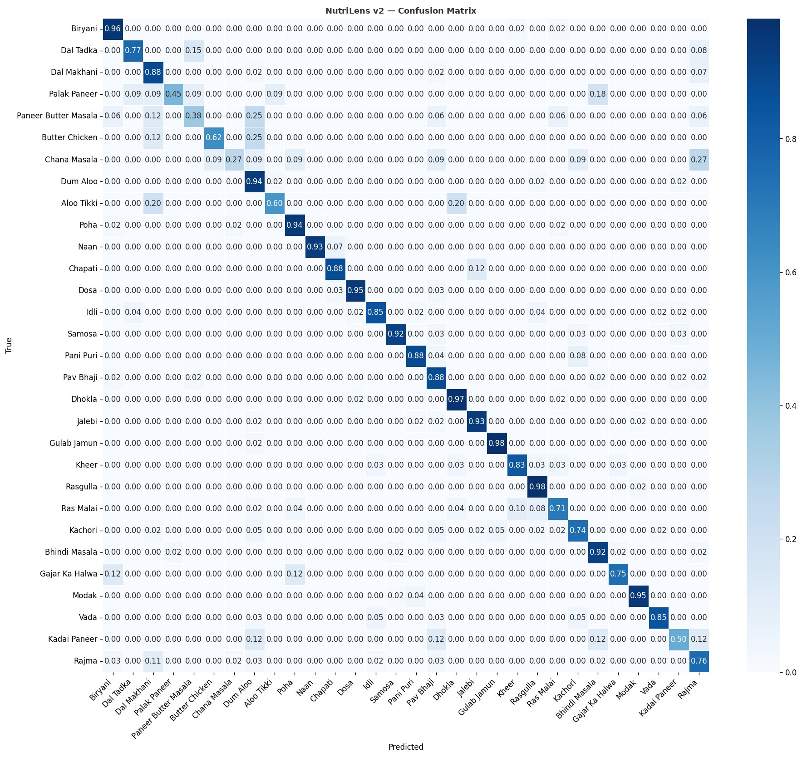

# ProteinLens 🔍🍽️

> **Real-time on-device food classification iOS app**  
> Point your camera at food — get instant nutrition estimates. No internet required.


---

## Demo


---

## What it does

ProteinLens uses a custom-trained **MobileNetV2 CNN** to classify food in real time via the iPhone camera. Optimised for Indian and globally popular foods.

**Live detection shows:**
- 🍽️ Food name with confidence score
- 💪 Protein / Calories / Fat / Carbs per serving
- ⚖️ Serving size slider — scale from 50g to 500g live
- 🕐 Scan history with daily protein totals
- ❄️ Tap anywhere to freeze frame and adjust serving size

**Everything runs on-device** — no API calls, no latency, no data leaving your phone.

---

## Architecture

```
┌─────────────────────────────────────────────────────────┐
│                    ProteinLens App                       │
├──────────────────┬──────────────────────────────────────┤
│   Training (ML)  │           iOS App (Swift)             │
│                  │                                       │
│  Food-101        │  AVFoundation → live camera frames    │
│  dataset         │         ↓                             │
│     ↓            │  Vision Framework → VNCoreMLRequest   │
│  MobileNetV2     │         ↓                             │
│  fine-tuned      │  CoreML → ProteinLens.mlpackage       │
│  (TensorFlow)    │         ↓                             │
│     ↓            │  SwiftUI → nutrition card overlay     │
│  coremltools     │         ↓                             │
│  conversion      │  ScanHistory → daily totals           │
│     ↓            │                                       │
│  .mlpackage      │                                       │
│  (5.9 MB)        │                                       │
└──────────────────┴──────────────────────────────────────┘
```

---

## Tech Stack

| Layer | Technology | Detail |
|---|---|---|
| Model training | Python, TensorFlow 2.19, Keras | MobileNetV2 fine-tuned on Food-101 |
| Dataset | Food-101 (India-optimised subset) | 20 classes × 750 train / 250 val |
| Model conversion | coremltools 7.2 | Keras → SavedModel → .mlpackage |
| iOS camera | AVFoundation | AVCaptureSession, live frames |
| iOS inference | Vision framework | VNCoreMLRequest, centerCrop |
| iOS UI | SwiftUI | Live overlay, serving size slider |
| On-device storage | In-memory | Scan history, daily totals |
| Deployment | CoreML, Neural Engine | Runs fully offline on iPhone |

---

## Model Performance

| Metric | Value |
|---|---|
| Architecture | MobileNetV2 (ImageNet pretrained, fine-tuned) |
| Training strategy | Two-phase: head only → top-layer fine-tuning |
| Dataset | Food-101 (20 India-optimised classes) |
| Training platform | Kaggle T4 x2 GPU |
| Phase 1 best accuracy | 80.3% |
| Phase 2 best accuracy | **86.0%** |
| Model size | 5.9 MB (.mlpackage) |
| Inference speed | < 50ms on iPhone (Neural Engine) |
| Confidence threshold | 40% |

---

## 20 Food Classes (India-optimised)

| # | Food | Protein/100g | Calories/100g |
|---|---|---|---|
| 1 | Chicken Curry 🍛 | 25.0g | 150 kcal |
| 2 | Samosa 🥟 | 6.0g | 262 kcal |
| 3 | Omelette 🍳 | 10.9g | 154 kcal |
| 4 | Egg 🥚 | 12.6g | 155 kcal |
| 5 | French Toast 🍞 | 8.0g | 229 kcal |
| 6 | Fried Rice 🍚 | 4.4g | 163 kcal |
| 7 | Momos 🥟 | 7.0g | 190 kcal |
| 8 | Spring Rolls 🌯 | 4.0g | 153 kcal |
| 9 | Hot & Sour Soup 🍲 | 3.0g | 95 kcal |
| 10 | Noodles 🍜 | 5.0g | 138 kcal |
| 11 | Chicken 🍗 | 27.0g | 203 kcal |
| 12 | Sandwich 🥪 | 18.0g | 290 kcal |
| 13 | Burger 🍔 | 20.3g | 295 kcal |
| 14 | Pizza 🍕 | 11.0g | 266 kcal |
| 15 | Fish 🐟 | 25.4g | 208 kcal |
| 16 | Hummus 🫘 | 7.9g | 177 kcal |
| 17 | Falafel 🧆 | 13.3g | 333 kcal |
| 18 | Pancakes 🥞 | 7.9g | 291 kcal |
| 19 | Rice Bowl 🍱 | 12.0g | 190 kcal |
| 20 | Steak 🥩 | 26.1g | 271 kcal |

---

## Project Structure

```
ProteinLens/
├── ml/
│   ├── train.ipynb                 # MobileNetV2 training (Kaggle)
│   ├── convert_to_coreml.py        # Keras → CoreML conversion
│   ├── verify_mlpackage.py         # Model verification script
│   ├── label_map.json              # Class labels + nutrition data
│   ├── protein_data.json           # USDA nutrition database
│   ├── ProteinLens.mlpackage/      # CoreML model (5.9MB)
│   └── DAY3_README.md              # Conversion documentation
├── iOS/
│   └── ProteinLens/
│       └── ProteinLens/
│           ├── FoodClassifier.swift    # AVFoundation + Vision + CoreML
│           ├── CameraView.swift        # SwiftUI camera overlay
│           ├── CameraPreview.swift     # AVCaptureVideoPreviewLayer
│           ├── HistoryView.swift       # Scan history screen
│           ├── ScanHistory.swift       # History data model
│           └── ContentView.swift       # Entry point
├── assets/
│   ├── training_curves.png         # Loss + accuracy curves
│   └── confusion_matrix.png        # Per-class accuracy heatmap
└── README.md
```

---

## Build Progress

| Day | Task | Status |
|---|---|---|
| Day 1 | Repo setup, Food-101 EDA, protein database | ✅ Done |
| Day 2 | MobileNetV2 fine-tuning — 86% val accuracy | ✅ Done |
| Day 3 | CoreML conversion — 5.9MB .mlpackage | ✅ Done |
| Day 4 | iOS camera + Vision + live detection | ✅ Done |
| Day 5 | Serving size slider (50-500g) + freeze frame | ✅ Done |
| Day 6 | Scan history + daily protein totals | ✅ Done |
| Day 7 | Demo recording + README polish | ✅ Done |

---

## Training Curves



---

## Confusion Matrix



---

## Resume Headline

> **ProteinLens** — Developed a real-time Computer Vision iOS app using a custom-trained CNN (MobileNetV2, 86% accuracy) to classify 20 food items and estimate nutritional values. Deployed entirely on-device using CoreML for privacy and speed. Built end-to-end: data → training → CoreML conversion → SwiftUI iOS app.

---

## How to run

### ML (training + conversion)
```bash
cd ml/
conda create -n coreml_env python=3.10 -y
conda activate coreml_env
pip install tensorflow-macos coremltools Pillow numpy

# Convert existing model to CoreML
python convert_to_coreml.py

# Verify output
python verify_mlpackage.py
```

### iOS app
1. Open `iOS/ProteinLens/ProteinLens.xcodeproj` in Xcode 16
2. Select your iPhone as target
3. `Cmd+R` to build and run
4. Grant camera permission on first launch

---

## Author

**Aditya Bhatt** 
